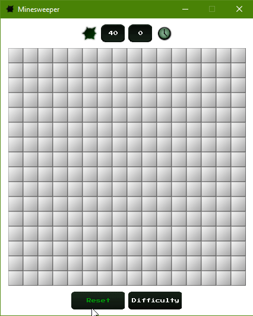

# Minesweeper
  The classic game programmed in C++ with SFML. This is a game made as a challenge between me, 
[artur99](https://github.com/artur99) and [iulyus01](https://github.com/iulyus01).

# Preview

# Release
  Visit release page or download directly from [here](https://github.com/pmaxim98/Minesweeper/releases/download/v1.0/Minesweeper.rar).

## IDE / Compiler
  - Visual Studio 2015 (C++14)
 
## Libraries
  - [SFML](https://www.sfml-dev.org) 2.4.2
    * [TGUI](https://tgui.eu) 0.7.4

## Note
  All resources are made by me. If you want to use them, check out [LICENSE](../master/LICENSE) for details. Don't forget to give credit.
